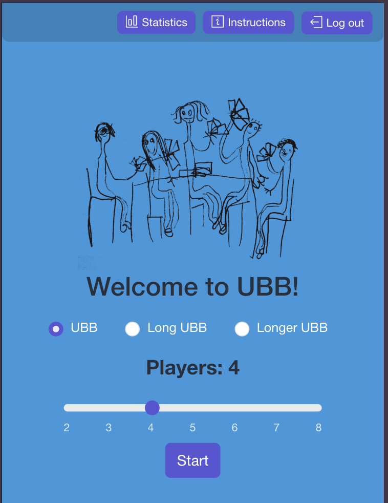
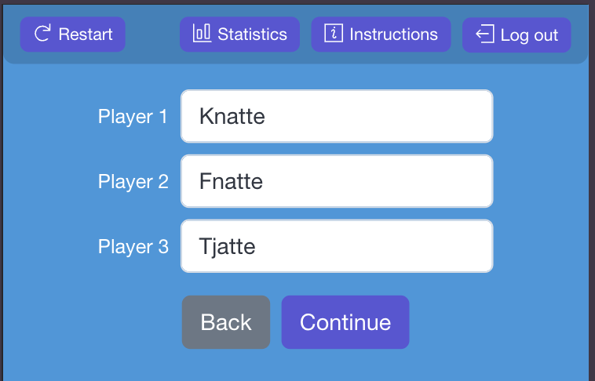
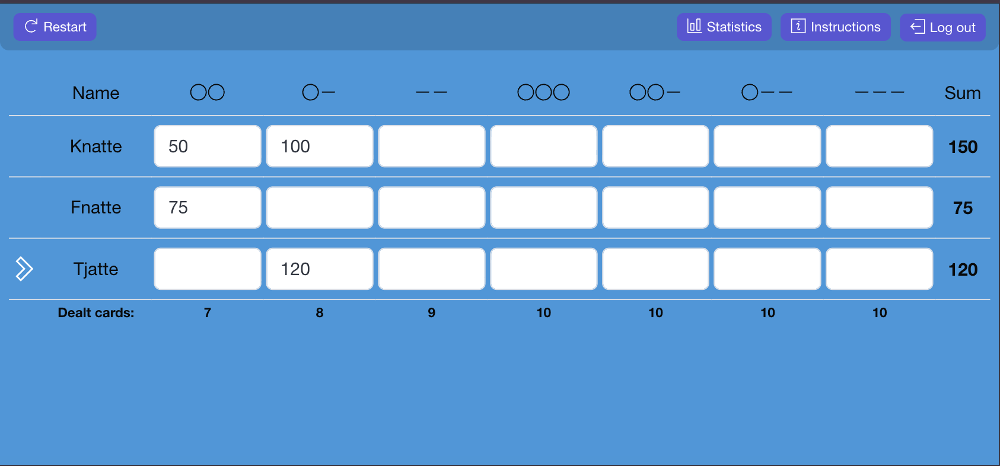
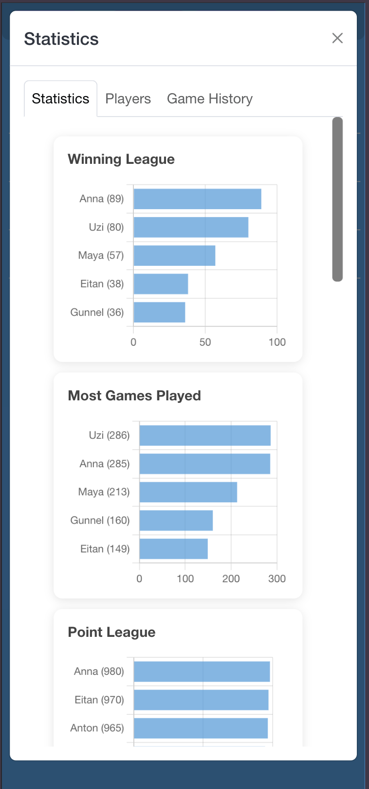
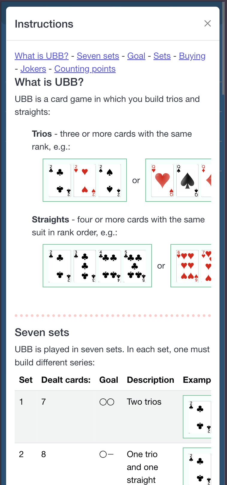

# vubb

UBB card game score tracker. Live at [ubbspel.se](https://ubbspel.se/). Vue 3 SPA — no router, navigation driven by
conditional rendering based on auth state and app phase.

## Features

- Google login (Firebase Auth)
- Player setup with name auto-complete based on previously used names
- Three board variants: normal (UBB), long, and longer
- Game history and per-player stats (Chart.js)
- In-app rules/instructions
- Game state persisted to localStorage; saved games stored in Firestore

## Screenshots

| Welcome | Player Names | Scoreboard |
| --- | --- | --- |
|  |  |  |

| Stats | Instructions |
| --- | --- |
|  |  |

## Architecture

```text
App.vue → Start.vue (orchestrator)
  Auth.vue              → Google login gate
  Players.vue           → player count/name setup
  Boards.vue            → tab switcher (normal/long/longer board variants)
    boards/Board.vue        → 7-set game
    boards/LongBoard.vue    → extended game
    boards/LongerBoard.vue  → longest variant
  stats/Stats.vue       → game history and player stats (Chart.js)
  Instructions.vue      → game rules
  Reset.vue             → reset game state
  GameSaved.vue         → save confirmation
```

**State (Pinia):**

- `AuthStore` — Firebase Auth user + ID token (not persisted)
- `PlayersStore` — player names and points arrays, persisted to localStorage
- `GamesStore` — Firestore games list, loading state, save action

**Backend:** Firebase (project `ubb-spel-aebae`) — Firestore for game
persistence, Google OAuth for auth.

**Key data models** (`src/models/`):

- `Player` — `{ name, points[], longerPoints[] }`
- `Game` — `{ playerNames[], rows[], winner, date, savedBy }`
- `Row` — per-player score row with fields `ss, sl, ll, sss, ssl, sll, lll, sum`

## Project Setup

```sh
npm install
```

### Compile and Hot-Reload for Development

```sh
npm run dev
```

### Type-Check, Compile and Minify for Production

```sh
npm run build
```

### Lint with [ESLint](https://eslint.org/)

```sh
npm run lint
```

### Format with [Prettier](https://prettier.io/)

```sh
npm run format
```

No test suite configured.

## Tech Stack

Vue 3, Vite, TypeScript, Pinia, Firebase (Auth + Firestore), CoreUI Vue,
Chart.js, Luxon, vue-i18n.

## Recommended IDE Setup

[VSCode](https://code.visualstudio.com/) + [Volar](https://marketplace.visualstudio.com/items?itemName=Vue.volar) (and
disable Vetur).
